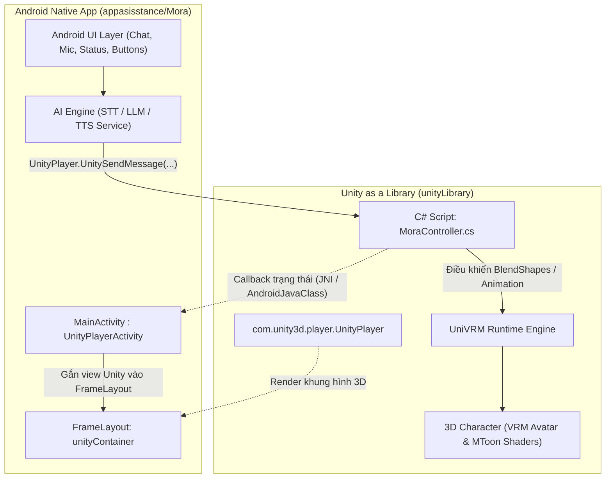

# Mora AI Assistant — Project Context & AI Development Guide

> **Mục đích tài liệu:** `AI.md` là tài liệu định chuẩn bối cảnh, kiến trúc dự án và quy tắc phát triển dành cho các AI Coding Assistant (Antigravity, Cursor, Claude Code, GitHub Copilot, v.v.) cũng như lập trình viên khi làm việc trên kho mã nguồn `apkproject`.

---

## 1. Tổng quan dự án (Project Overview)

- **Tên dự án:** Mora Virtual Assistant (`MoraAssistant`)
- **Mục tiêu:** Ứng dụng trợ lý ảo 3D trên hệ điều hành Android, kết hợp giữa mô hình nhân vật hoạt hình 3D (định dạng **VRM** qua **Unity**) và logic ứng dụng **Native Android (Kotlin)**.
- **Tính năng cốt lõi hiện tại & mục tiêu:**
  - Hiển thị nhân vật 3D avatar tương tác thời gian thực trong giao diện Android Native thông qua kiến trúc **Unity as a Library (UaaL)**.
  - Điều khiển camera, ánh sáng, góc nhìn và xoay/tương tác nhân vật.
  - **Mục tiêu mở rộng (AI Assistant Roadmap):**
    - Trò chuyện với người dùng qua giọng nói và văn bản (STT & TTS).
    - Tích hợp mô hình ngôn ngữ lớn (LLM: Gemini / OpenAI / On-device LLM).
    - Đồng bộ khẩu hình môi thời gian thực (Lip-Sync qua BlendShapes VRM: A, I, U, E, O).
    - Biểu cảm khuôn mặt (Vui, buồn, ngạc nhiên, suy nghĩ) và hoạt ảnh cử chỉ (Idle, Greeting, Listening).

---

## 2. Kiến trúc hệ thống & Cấu trúc thư mục

### 2.1. Sơ đồ kiến trúc tổng thể



### 2.2. Chi tiết cấu trúc thư mục trong Workspace

```
D:\apkproject\
├── AI.md                              # [TÀI LIỆU NÀY] Hướng dẫn & Context cho AI
├── alphaapk\                          # Project mẫu Android độc lập (test cơ bản)
│   ├── app\src\main\java\...          # Package com.alpha.alphaapk
│   └── build.gradle.kts
│
├── appasisstance\                     # KHÔNG GIAN DỰ ÁN CHÍNH (Core Project)
│   ├── xxx.vrm                        # File mô hình 3D VRM gốc của nhân vật Mora
│   │
│   ├── Mora\                          # Dự án Android Native chính (Mở bằng Android Studio)
│   │   ├── app\                       # Module app chính
│   │   │   ├── src\main\java\com\mora\assistant\
│   │   │   │   └── MainActivity.kt    # Entry point nhúng UnityPlayer vào FrameLayout
│   │   │   ├── src\main\res\layout\
│   │   │   │   └── activity_main.xml  # Layout chứa unityContainer & UI Native
│   │   │   └── build.gradle.kts       # Config module app (phụ thuộc vào :unityLibrary)
│   │   ├── unityLibrary\              # Module thư viện Unity được nhúng vào Android
│   │   │   ├── libs\                  # Thư viện runtime Unity (*.jar, *.aar)
│   │   │   ├── src\main\              # Assets, JNI libs (.so), và C++ IL2CPP code
│   │   │   └── build.gradle           # Cấu hình build cho Unity Library
│   │   ├── gradle\libs.versions.toml  # Quản lý phiên bản dependencies tập trung
│   │   ├── build.gradle.kts           # Root gradle script
│   │   ├── settings.gradle.kts        # Include :app và :unityLibrary
│   │   └── local.properties           # Cấu hình sdk.dir và ndk.dir cục bộ
│   │
│   ├── MoraUnity\                     # Dự án Unity Editor (Mở bằng Unity 2022.3.60f1)
│   │   ├── Assets\
│   │   │   ├── Scripts\
│   │   │   │   └── MoraController.cs  # Script C# điều khiển Camera, Xoay, Tương tác
│   │   │   ├── Scenes\
│   │   │   │   └── SampleScene.unity  # Scene 3D chứa nhân vật Mora và Camera
│   │   │   ├── xxx.prefab             # Prefab nhân vật 3D đã import từ VRM
│   │   │   └── xxx.Avatar/Materials.. # Textures, Materials, BlendShapes của nhân vật
│   │   ├── Packages\
│   │   │   ├── com.vrmc.univrm        # Package UniVRM (Xử lý định dạng VRM)
│   │   │   ├── com.vrmc.gltf          # Package UniGLTF
│   │   │   └── manifest.json          # Danh sách Unity Package dependencies
│   │   └── ProjectSettings\           # Cấu hình Unity (Unity 2022.3.60f1)
│   │
│   └── MoraUnityExport\               # Thư mục xuất bản từ Unity (Export Project)
│       ├── unityLibrary\              # Thư mục nguồn dùng để copy/sync vào Mora/unityLibrary
│       └── launcher\                  # Thư mục launcher standalone (không dùng trực tiếp)
```

---

## 3. Thông số kỹ thuật & Môi trường phát triển (Tech Stack & Environment)

### 3.1. Phía Android Native (`appasisstance/Mora`)
- **Ngôn ngữ:** Kotlin (`1.9.24`)
- **Android Gradle Plugin (AGP):** `8.5.2`
- **Gradle:** `8.7+` (Gradle Wrapper)
- **SDK Targets:**
  - `compileSdk`: `35` (Android 15)
  - `targetSdk`: `35`
  - `minSdk`: `26` (Android 8.0 Oreo)
- **NDK Version:** `23.1.7779620` (r23b) — *Lưu ý quan trọng: Unity IL2CPP yêu cầu NDK tương thích chính xác.*
- **ABI Filters:** `armeabi-v7a`, `arm64-v8a`
- **Java Compatibility:** Java 11 (`JavaVersion.VERSION_11`)
- **View Binding:** Kích hoạt (`viewBinding = true`)
- **Namespace / App ID:** `com.mora.assistant`

### 3.2. Phía Unity (`appasisstance/MoraUnity`)
- **Unity Version:** `2022.3.60f1 LTS`
- **Scripting Backend:** IL2CPP (để tối ưu hiệu năng và hỗ trợ 64-bit trên thiết bị Android)
- **VRM Runtime:** UniVRM (`com.vrmc.univrm`, `com.vrmc.gltf`)
- **Render Pipeline:** Built-in Render Pipeline với shader MToon (VRM chuyên dụng cho Anime style)

---

## 4. Quy trình đồng bộ Unity sang Android (UaaL Sync Workflow)

Khi có thay đổi về 3D, animation hoặc C# script trong `MoraUnity`, quy trình cập nhật sang ứng dụng Android như sau:

1. **Mở Unity Editor:**
   - Mở dự án tại `D:\apkproject\appasisstance\MoraUnity` bằng Unity 2022.3.60f1.
2. **Cấu hình Build Settings:**
   - Nhấn `File` -> `Build Settings...`.
   - Chọn nền tảng: **Android**.
   - Tích chọn checkbox: **Export Project** (Quan trọng: Không bấm Build APK mà bấm Export).
   - Nhấn **Export** và chọn thư mục đích: `D:\apkproject\appasisstance\MoraUnityExport`.
3. **Đồng bộ mã nguồn sang Android:**
   - Sao chép nội dung thư mục `MoraUnityExport/unityLibrary` đè vào `appasisstance/Mora/unityLibrary`.
   - *Lưu ý kiểm tra file `appasisstance/Mora/unityLibrary/build.gradle`:*
     - Đảm bảo `compileSdkVersion 35` và `ndkVersion "23.1.7779620"`.
     - Giữ nguyên thiết lập `noCompress` và `packagingOptions`.
4. **Build & Chạy Android App:**
   - Mở thư mục `D:\apkproject\appasisstance\Mora` bằng Android Studio.
   - Chạy Gradle Sync và tiến hành chạy ứng dụng lên thiết bị thật hoặc máy ảo ARM64.

---

## 5. Cơ chế giao tiếp 2 chiều (Android <-> Unity Bridge)

### 5.1. Android gửi lệnh sang Unity (`UnityPlayer.UnitySendMessage`)
Để gửi lệnh từ Kotlin sang đối tượng Unity trong Scene:
```kotlin
// Cú pháp: UnityPlayer.UnitySendMessage(TargetGameObjectName, MethodName, ParameterString)

// Ví dụ 1: Yêu cầu dừng xoay nhân vật
com.unity3d.player.UnityPlayer.UnitySendMessage("CharacterRoot", "StopRotation", "")

// Ví dụ 2: Kích hoạt biểu cảm vui vẻ (Joy)
com.unity3d.player.UnityPlayer.UnitySendMessage("CharacterRoot", "SetExpression", "Joy")

// Ví dụ 3: Đồng bộ khẩu hình miệng phát âm (Lip Sync)
com.unity3d.player.UnityPlayer.UnitySendMessage("CharacterRoot", "SetVowel", "A:0.8")
```

### 5.2. Nhận lệnh phía Unity (C#)
Trong script C# gắn vào GameObject có tên tương ứng (ví dụ `MoraController.cs`):
```csharp
using UnityEngine;
using VRM; // Nếu thao tác với UniVRM

public class MoraController : MonoBehaviour
{
    private VRMBlendShapeProxy blendShapeProxy;

    void Start()
    {
        blendShapeProxy = GetComponent<VRMBlendShapeProxy>();
    }

    // Nhận cuộc gọi từ Android
    public void StopRotation()
    {
        enabled = false;
    }

    public void SetExpression(string expressionName)
    {
        if (blendShapeProxy == null) return;

        // Reset biểu cảm cũ và kích hoạt biểu cảm mới
        blendShapeProxy.ImmediatelySetValue(BlendShapeKey.CreateFromPreset(BlendShapePreset.Joy), 1.0f);
    }
}
```

### 5.3. Unity gọi ngược về Android Native (C# -> Java/Kotlin)
Khi nhân vật kết thúc cử động, hoặc người dùng chạm vào nhân vật trong màn hình 3D:
```csharp
#if UNITY_ANDROID && !UNITY_EDITOR
public static void NotifyAndroid(string actionName, string data)
{
    using (AndroidJavaClass jc = new AndroidJavaClass("com.unity3d.player.UnityPlayer"))
    {
        AndroidJavaObject activity = jc.GetStatic<AndroidJavaObject>("currentActivity");
        activity.Call("onUnityEventReceived", actionName, data);
    }
}
#endif
```

---

## 6. Lộ trình tích hợp tính năng Trợ lý ảo AI (AI Features Blueprint)

```
[Người dùng nói]
       │
       ▼
 [STT Module] ──► (Văn bản câu hỏi)
                        │
                        ▼
                 [LLM Engine] (Gemini / Claude / On-device)
                        │
                        ▼ (Câu trả lời văn bản)
                 [TTS Engine] ──► [Audio Stream] (Loa phát tiếng)
                        │
                        ▼ (Phân tích biên độ / Viseme)
             [Unity Bridge: Lip-Sync & Expression]
                        │
                        ▼
            [VRM Avatar cử động môi & biểu cảm trên màn hình]
```

1. **Speech-to-Text (STT):**
   - Sử dụng `android.speech.SpeechRecognizer` (sẵn có trên Android) hoặc OpenAI Whisper API / Sherpa-ONNX (offline).
2. **Xử lý hội thoại (LLM Agent):**
   - Gọi API Gemini (`google-genai` / REST API) hoặc mô hình OpenAI với Persona thân thiện, đóng vai "Trợ lý Mora".
3. **Text-to-Speech (TTS):**
   - Sử dụng `android.speech.tts.TextToSpeech` hoặc dịch vụ tạo giọng tự nhiên (Google Cloud TTS, Edge TTS).
4. **Đồng bộ môi & Cử chỉ (Lip-sync & Gestures):**
   - Phân tích biên độ âm thanh (RMS amplitude) từ luồng Audio để ánh xạ sang các BlendShape `A`, `I`, `U`, `E`, `O` trong UniVRM.
   - Thêm chuyển động nhấp nháy mắt tự động (`Blink`) và hơi thở nhẹ (Breathing) để nhân vật luôn sống động.

---

## 7. Nguyên tắc & Hướng dẫn dành riêng cho AI Coding Assistant

Khi hỗ trợ phát triển hoặc sinh mã cho kho lưu trữ này, AI cần tuân thủ nghiêm ngặt các nguyên tắc sau:

1. **Không can thiệp trực tiếp vào file nhị phân của Unity:**
   - Tuyệt đối không cố gắng tự tạo hoặc sửa đổi bằng tay các file `.unity`, `.prefab`, `.asset`, `.meta` nếu không chắc chắn về cấu trúc serialize YAML của Unity.
   - Mọi thay đổi logic 3D nên được thực hiện qua các file mã nguồn C# (`Assets/Scripts/*.cs`) và hướng dẫn lập trình viên mở Unity Editor để lưu Scene/Prefab nếu cần thiết.
2. **Quản trị vòng đời UnityPlayer trên Android:**
   - `MainActivity.kt` hiện kế thừa từ `UnityPlayerActivity`.
   - Khi chỉnh sửa hoặc bổ sung Fragment/Activity mới, phải đảm bảo gọi `unityPlayer?.resume()`, `unityPlayer?.pause()`, và `unityPlayer?.destroy()` đúng sự kiện Lifecycle của Android để tránh rò rỉ bộ nhớ hoặc xung đột OpenGL/Vulkan surface.
3. **Giữ tính tương thích cấu hình NDK & Gradle:**
   - File `local.properties` của `appasisstance/Mora` chứa đường dẫn `sdk.dir` và `ndk.dir`. Không sửa đổi phiên bản NDK tùy tiện nếu không đồng bộ với phiên bản NDK mà Unity Editor sử dụng (`23.1.7779620`).
   - Sử dụng `gradle/libs.versions.toml` khi khai báo thư viện mới cho Android thay vì hardcode version trong `build.gradle.kts`.
4. **Phân tầng giao diện (UI Layering):**
   - Unity render lên một SurfaceView/GLSurfaceView bên trong `unityContainer` (FrameLayout).
   - Toàn bộ UI trợ lý (Khung chat, bong bóng thoại, thanh nhập liệu, nút micro) phải được bố trí ở các View/ViewGroup phía trên trong `activity_main.xml` với nền trong suốt (`android:background="@android:color/transparent"`).
5. **Định vị mã nguồn làm việc chính:**
   - Luôn làm việc chủ đạo tại thư mục `appasisstance/Mora` (Android) và `appasisstance/MoraUnity` (Unity).
   - Thư mục `alphaapk` chỉ dùng cho mục đích tham khảo hoặc thử nghiệm độc lập.

---

## 8. Lệnh thao tác nhanh (Useful Commands)

### 8.1. Kiểm tra và Build Android APK (PowerShell)
```powershell
# Chuyển vào thư mục Android app
cd appasisstance\Mora

# Kiểm tra cú pháp và build bản Debug
.\gradlew.bat assembleDebug

# Cài đặt file APK lên thiết bị kết nối qua adb
adb install -r app\build\outputs\apk\debug\app-debug.apk
```

### 8.2. Theo dõi log ứng dụng (Logcat)
```powershell
# Lọc log Unity và app Mora
adb logcat -s Unity:V MoraAssistant:V AndroidRuntime:E
```

